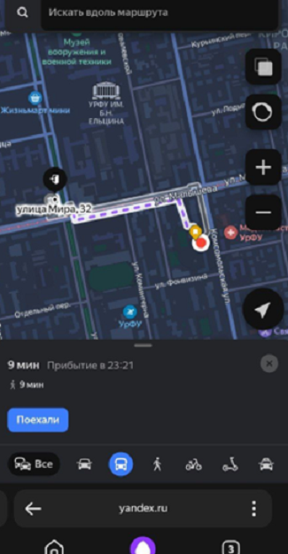

# «Где найти аудиторию в УрФУ» — навигатор студента УрФУ для Яндекс Алисы

Проект разработан в рамках проектного практикума для помощи студентам УрФУ в поиске аудиторий и построении маршрутов между корпусами университета с помощью голосового помощника Яндекс Алиса.

Навигатор обеспечивает быстрый и удобный доступ к информации о расположении аудиторий, что помогает студентам экономить время и избегать путаницы

# Как работает:
1. Активируйте навык, скажите "Алиса, где найти аудиторию в УрФУ"
2. Далее для поиска конкретной аудитории скажите: "Найди аудиторию **номер_аудитории**" *(Если аудитория не найдена в базе данных, Алиса предложит вам попробовать поискать другую)*
